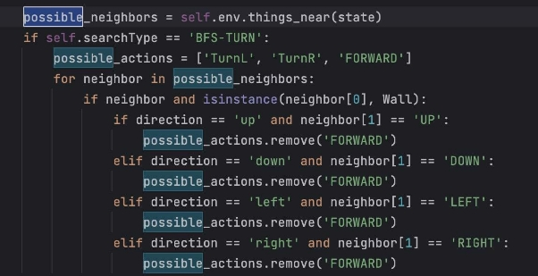
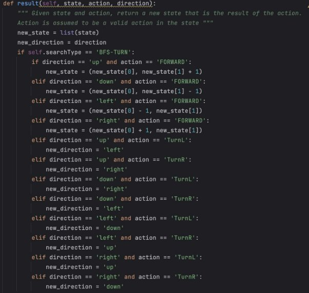
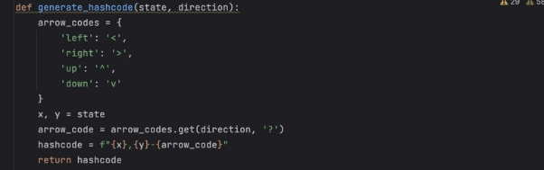
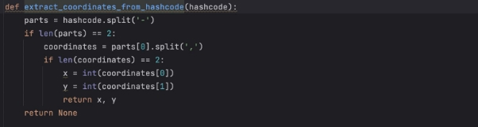
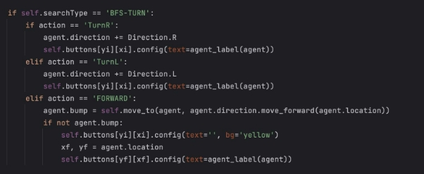

**Search Assignment - Analysis**

**Implementation**

To address the limitation in the search problem, we can enhance the Node class by adding a "direction" attribute. This addition allows us to consider the agent's facing direction when selecting actions. Instead of the traditional 'LEFT', 'RIGHT', 'UP', and 'DOWN' actions, we introduce 'TURN LEFT', 'TURN RIGHT', and 'FORWARD' actions. However, in certain situations, we can exclude the 'FORWARD' action. For instance, if the agent is facing a wall, there is no need to consider moving forward. This modification helps reduce unnecessary node expansions and prevents the agent from running into walls.

Figure 1. Action function

When considering the turning direction, the agent will move to a new state only when the 'FORWARD' action is executed. In other cases, such as turning left or right, the agent will remain in the same state but update its facing direction. For instance, in Figure 2, if the agent is initially facing upward and performs the 'FORWARD' action, its state will be updated to the top position. However, if the agent turns left or right, the state remains the same, but the facing direction changes accordingly. For example, if the agent is facing left and performs a left turn, it will now be facing downward.

Figure 2. Result function

To address the issue of detecting whether a node has been explored or not, a hashcode is generated for each node using its state and direction. This hashcode is then used to check for node exploration instead of directly using the states of the node. The generate\_hashcode function, as shown in Figure 3, combines the node's state and direction into a string to create a unique hashcode for that node. By using the hashcode, we can easily check if a node has been explored by verifying if its hashcode is present in the explored set. This approach takes into account the facing direction of the agent and ensures that nodes with the same state but different directions are treated as distinct nodes during exploration.

Figure 3. generate\_hascode function

To ensure the proper functioning of the display\_explored function, we require a decode function to extract the state from the hashcode stored in the explored set. This is necessary because the explored set does not directly store the node state. By implementing the decode function, we can extract and retrieve the explored state, allowing us to accurately display the explored states in the function.

Figure 4. extract\_coordinate\_from\_hashcode function

In order to maintain accurate visualization on the GUI, the execute\_action function required modifications due to the change in the agent's actions. The updated code in Figure 5 demonstrates these modifications: if the action is a turn to the left or right, the agent's label will be adjusted accordingly, while moving forward will relocate the agent's label to the new state without altering its direction.

Figure 5. exectue\_action function

**Analysis**

After conducting several tests on the Breadth-First Search with a turning factor, I have noticed that the agent generates a solution to the closest destination, but the path it takes is not always optimal. The agent may take additional steps to turn into the correct direction, resulting in a longer path. This happens because when we evaluate the goal state, we only consider the distance between the starting state and the goal state, and the direction changes do not affect this distance. As a result, using Uniform Cost Search may yield a more efficient solution path compared to Breadth-First Search. By considering each turning action and forward action as 1 step, we can incorporate them into the path\_cost attribute of each node. This approach allows the priority queue storing the frontiers to prioritize nodes that require fewer turns to reach the desired direction. Consequently, fewer nodes need to be explored to align the agent correctly, leading to a more efficient search process.

**Conclusion**

Introducing the turning direction into the search problem improves the reality for this vacuum agent project. By excluding unnecessary actions and introducing hashcodes for node exploration tracking, the search algorithm becomes more efficient. Additionally, incorporating step costs enables the generation of optimal paths, resulting in improved search performance.
